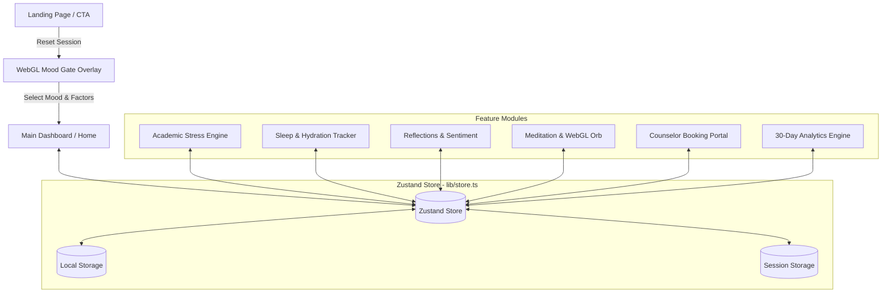

# 🌸 Mentebloom — Mental Wellness & Academic Stress Management Platform

<p align="center">
  <a href="https://mental-wellness-lemon.vercel.app/">
    
  </a>
</p>

<p align="center">
  
  
  
  
  
  
  
  
</p>

> 🚀 **Live Production Deployment**: [https://mental-wellness-lemon.vercel.app/](https://mental-wellness-lemon.vercel.app/)

---

## 📑 Table of Contents

- [Overview](#-overview)
- [Design Aesthetics & Philosophy](#-design-aesthetics--philosophy)
- [Key Features & Modules](#-key-features--modules)
  - [1. Interactive WebGL Mood Gate Overlay](#1-interactive-webgl-mood-gate-overlay-moodgate)
  - [2. Editorial Dashboard & Dynamic Hero](#2-editorial-dashboard--dynamic-hero)
  - [3. Subject-Wise Academic Stress Engine](#3-subject-wise-academic-stress-engine-academicstress)
  - [4. Physical Wellness, Hydration & Sleep Tracker](#4-physical-wellness-hydration--sleep-tracker-wellness)
  - [5. Mindful Journal & Sentiment Analysis](#5-mindful-journal--sentiment-analysis-journal)
  - [6. Mindful Meditation & Audio Soundscapes](#6-mindful-meditation--audio-soundscapes-meditation)
  - [7. Counselor Consultation Booking Portal](#7-counselor-consultation-booking-portal-consultation)
  - [8. 30-Day Comprehensive Analytics](#8-30-day-comprehensive-analytics-analytics)
- [Technical Architecture & State Flow](#-technical-architecture--state-flow)
- [Component & WebGL Shader Catalog](#-component--webgl-shader-catalog)
- [Technology Stack](#-technology-stack)
- [Project Directory Structure](#-project-directory-structure)
- [Getting Started & Local Development](#-getting-started--local-development)
- [Production Build & Deployment](#-production-build--deployment)
- [License](#-license)

---

## 📌 Overview

**Mentebloom** is a modern, high-performance mental wellness and academic stress management platform built specifically for students and high-performing individuals. 

While conventional wellness apps offer generic meditation timers or isolated habit trackers, they overlook the **#1 trigger for student burnout: academic workload density and impending deadlines**. 

Mentebloom bridges this gap by combining an algorithmic **Subject-Wise Academic Stress Engine** with real-time mood logging, habit tracking, hydration monitoring, sleep/exercise correlation analytics, guided box breathing, and professional counselor booking — all framed within a warm editorial light/dark glassmorphism design with GPU-accelerated WebGL shaders.

---

## 🎨 Design Aesthetics & Philosophy

Mentebloom is built on an **Editorial Glassmorphism** design language that feels calm, modern, and engaging:

- **Canvas Palette**: Warm Soft Cream (`#faf8f5`) base contrasting with deep charcoal typography (`#1a1a1a`) and dark modal experiences (`#111111` / `#000000`).
- **Signature Accent**: Electric Lime Green (`#c8f54e`) used for active indicators, streaks, and interactive highlights.
- **Visual Depth**: Multi-layer glass cards with subtle borders (`border-[#e8e4df]`), specular gloss effects, and backdrop blur.
- **GPU-Accelerated Shaders**: Embedded WebGL raymarching sine-plasma, iridescent 3D orbs, and silk wave canvases that react in real-time to user interactions without degrading framerates.
- **Micro-Interactions**: Smooth entrance morphs, checkmark celebrations, rotating conic gradient borders, and Lenis smooth scrolling.

---

## ✨ Key Features & Modules

### 1. Interactive WebGL Mood Gate Overlay (`MoodGate`)
* **Raymarching Sine-Plasma Shader (`GradientWaves.tsx`)**: Full-screen WebGL shader powered by `ogl` featuring live procedural film grain and mouse parallax cursor distortion.
* **Mood-Reactive RGB Color Morphing**: Smooth per-frame RGB lerping transitions wave colors dynamically as the user hovers or selects their current mood:
  - **Down (Sad)**: Deep Crimson / Blood Red
  - **Low**: Deep Royal Purple / Violet
  - **Neutral (Okay)**: Warm Grey / Slate Beige
  - **Good**: Deep Oceanic Navy Blue
  - **Great**: Deep Forest / Emerald Green
* **Overlapping Avatar Stack (`OverlappingMoodStack.tsx`)**: Illustrated circular emoji badge stack with white ring borders, active label pills, and pop-out scaling.
* **Contextual Life Factors**: Tag contributing factors (Study, Sleep, Health, Friends, Family, Work, Hobbies).
* **Motivational Inspiration & Session Handoff**: Delivers an uplifting quote tailored to the selected mood before smoothly transitioning into the main dashboard. Session persistence ensures frictionless navigation between tabs.

---

### 2. Editorial Dashboard & Dynamic Hero
* **Dynamic Morphing Header (`HeroSection.tsx`)**: Static serif headline ("Daily") paired with a smoothly morphing italic accent word (*Practice*, *Growing*, *Learning*, *Motivation*, *Mindfulness*, *Focus*, *Reflection*, *Progress*) using Framer Motion blur-slide transitions.
* **Today's Note Carousel (`TodaysNote.tsx`)**: Powered by a custom `MoltenMetal` WebGL shader; dynamically calculates your highest-performing habit and weekly consistency percentage to provide actionable daily affirmations.
* **Multi-Mode Habit Matrix (`HabitsTable.tsx`)**:
  - **7-Day Weekly Grid**: Daily checkboxes with checkmark micro-animations, time-travel week navigation (`< Prev` / `Next >`), and future date locking to prevent logging ahead of time.
  - **30-Day Monthly Matrix**: Full calendar grid overview for long-term consistency tracking.
  - **Mobile Touch Optimization**: Horizontal scroll container with swipe gestures for narrow mobile screens.
* **Streak Card & Rotating Border (`StreakFooter.tsx`)**:
  - Displays consecutive streak days, flame icon, floating particle embers, and weekly completion soundwave mini-chart.
  - Built with a robust 2-layer `BorderRotate` component featuring rotating conic gradient borders.
* **Wellness Score (`WellnessScore.tsx`)**:
  - Animated circular progress ring powered by a live WebGL `Silk` shader (`@react-three/fiber`).
  - Breakdown across Mood, Habits, Hydration, and Reflections with live percentage badges.

---

### 3. Subject-Wise Academic Stress Engine (`AcademicStress`)
* **Algorithmic Workload & Urgency Formula**:
  $$\text{Workload Index} = \sum_{i=1}^{n} \left( \text{Estimated Hours}_i \times \text{Difficulty Multiplier}_i \times \text{Urgency Multiplier}_i \right)$$
  - **Difficulty Multipliers**: Easy ($1.0\times$), Medium ($1.35\times$), Hard ($1.75\times$), Extreme ($2.3\times$)
  - **Urgency Multipliers**: Overdue ($2.5\times$), Due in $\le 24\text{h}$ ($2.1\times$), $\le 3\text{d}$ ($1.6\times$), $\le 7\text{d}$ ($1.25\times$)
* **5 Normalized Stress Tiers**:
  - 🟢 **Relaxed (0–20%)** | 🟡 **Manageable (21–40%)** | 🟠 **Busy (41–60%)** | 🔴 **Overloaded (61–80%)** | 🟣 **Critical (81–100%)**
* **Subject Strain Breakdown**: Calculates workload distribution per course (e.g., *Data Structures*, *Linear Algebra*, *Quantum Mechanics*) and flags the highest workload contributor with a `HIGHEST STRAIN` badge.
* **Interactive Task Manager**: Add, filter, complete, and track assignments with real-time updates to the global stress score.

---

### 4. Physical Wellness, Hydration & Sleep Tracker (`Wellness`)
* **Hydration Tracker**: Target tracking with quick-add water controls ($+250\text{ml}$, $+500\text{ml}$) and 7-day intake bar charts.
* **Sleep Quality Monitor**: Log sleep duration and quality rating (1 to 5 stars) with trend sparklines and correlation insights against daily mood.
* **Exercise Log**: Track duration and intensity across Yoga, Gym, Running, Walking, Cycling, Swimming, and Sports.
* **Dark Aesthetic Shader Cards**: Re-themed containers embedded with WebGL shaders including `<LightRays />`, `<Aurora />`, `<FaultyTerminal />`, and `<LiquidChrome />`.

---

### 5. Mindful Journal & Sentiment Analysis (`Journal`)
* **Real-Time Auto-Save**: Seamlessly persists reflections to local storage with zero data loss.
* **Automated Sentiment Analysis**: Instant sentiment tagging (*Positive*, *Reflective*, *Neutral*) based on entry language.
* **Guided Prompts**: Curated prompts to spark mindfulness and gratitude.
* **Mood Correlation**: Links daily journal entries to mood state for retrospective timeline exploration.

---

### 6. Mindful Meditation & Audio Soundscapes (`Meditation`)
* **Box Breathing Visualizer**: Interactive 4-4-4 cycle animation (*4s Inhale, 4s Hold, 4s Exhale, 4s Hold*) with dynamic guidance text.
* **Iridescent WebGL Plasma Orb (`Orb.tsx`)**: Full-screen interactive shader background reacting to mouse proximity and cursor movements.
* **Ambient Soundscapes**: Calming background audio routines for focus, stress relief, and deep relaxation.

---

### 7. Counselor Consultation Booking Portal (`Consultation`)
* **Verified Specialist Directory**: Directory of certified Indian clinical psychologists, psychiatrists, and NIMHANS/AIIMS mental health professionals.
* **Filter by Specialization & Mode**: Filter by Anxiety, Academic Stress, Burnout, Sleep, and consultation mode (*Online*, *In-Person*, *Both*).
* **Doctor Profile Cards (`BorderGlow.tsx`)**: Subtle animated border glow with credential badges and clinic location tags.
* **Interactive Booking Sheet**: Date selector, time slots, consultation mode toggle, Sonner toast confirmations, and live clinical metrics report preview.

---

### 8. 30-Day Comprehensive Analytics (`Analytics`)
* **Mood Trajectory Chart**: 30-day timeline showing mood fluctuations and peak emotional states.
* **Habit Completion Trends**: Category-by-category breakdown of consistency rates.
* **Hydration & Sleep Correlators**: Visual charts highlighting correlations between sleep duration, water intake, and academic stress levels.

---

## 🏗️ Technical Architecture & State Flow



### Core Architecture Highlights:
1. **Single Source of Truth**: Managed via Zustand (`lib/store.ts`) with custom JSON storage middleware for `localStorage` (`mentebloom-v3-storage`) and `sessionStorage`.
2. **Instant Cross-Widget Synchronization**: Modifying a habit, logging sleep, or adding an academic task immediately updates all connected widgets (Hero progress, Today's Note, Wellness Score, Weekly Pulse, and Analytics) with zero manual refetches or page reloads.
3. **GPU-Accelerated Shaders**: WebGL pipelines utilize lightweight fragment shaders via `ogl` and `@react-three/fiber`, maintaining 60 FPS with automatic resource disposal and pixel-ratio scaling.
4. **Smooth Navigation & Lenis**: Integrated `ReactLenis` for momentum scrolling alongside declarative `wouter` routing.

---

## 🧩 Component & WebGL Shader Catalog

| Component | Path | Description | Tech Stack |
|---|---|---|---|
| `GradientWaves` | `client/src/components/ui/GradientWaves.tsx` | Full-screen raymarching sine-plasma shader with real-time RGB lerping | WebGL, `ogl`, React |
| `Orb` | `client/src/components/ui/Orb.tsx` | Iridescent 3D plasma orb with mouse proximity distortion | WebGL, `ogl`, React |
| `Silk` | `client/src/components/ui/Silk.tsx` | Animated silk wave canvas background for Wellness Score | WebGL, `@react-three/fiber`, `three` |
| `MoltenMetal` | `client/src/components/ui/MoltenMetal.tsx` | Fluid metallic shader background for Today's Note card | WebGL, `ogl`, React |
| `ColorBends` | `client/src/components/ui/ColorBends.tsx` | Morphing chromatic gradient background | WebGL, `ogl`, React |
| `SpecularButton` | `client/src/components/ui/SpecularButton.tsx` | WebGL specular glass highlight interactive button | WebGL, `ogl`, React |
| `animated-gradient-border` | `client/src/components/ui/animated-gradient-border.tsx` | 2-layer rotating conic gradient border container (`BorderRotate`) | Framer Motion, React |
| `OverlappingMoodStack` | `client/src/components/ui/OverlappingMoodStack.tsx` | Ring-bordered circular emoji avatar badge stack | Framer Motion, Tailwind |
| `card-fan-carousel` | `client/src/components/ui/card-fan-carousel.tsx` | GSAP 3D interactive circular emoji orb fan carousel | GSAP, React |
| `BorderGlow` | `client/src/components/ui/BorderGlow.tsx` | Animated gradient border glow wrapper | CSS Animations, Tailwind |
| `BlurText` | `client/src/components/ui/BlurText.tsx` | Letter-by-letter and word-by-word blur entrance effect | Framer Motion, React |

---

## 🛠️ Technology Stack

| Domain | Technologies |
|---|---|
| **Frontend Framework** | React 19, TypeScript 5.6, Vite 7 |
| **Routing & Navigation** | Wouter 3.3, ReactLenis (Smooth Scrolling) |
| **Styling & Design** | Tailwind CSS 4.1, Lucide React Icons, Radix UI Primitives |
| **Animations** | Framer Motion 12.2, GSAP 3.15 |
| **WebGL & Shaders** | `ogl` (Open Graphics Library), `@react-three/fiber`, `three.js` |
| **State Management** | Zustand 5.0 with Local/Session Storage Persistence |
| **Data Visualization** | Recharts 2.15 |
| **Notifications** | Sonner Toast |
| **Backend & Server** | Node.js, Express 4.21, Esbuild |

---

## 📂 Project Directory Structure

```
c:/meow/pixxo/
├── client/
│   ├── src/
│   │   ├── components/
│   │   │   ├── ui/                        # Reusable WebGL shaders & UI primitives
│   │   │   │   ├── GradientWaves.tsx      # Mood-reactive WebGL plasma wave shader
│   │   │   │   ├── Orb.tsx                # WebGL iridescent orb shader
│   │   │   │   ├── Silk.tsx               # R3F silk wave shader canvas
│   │   │   │   ├── MoltenMetal.tsx        # Shader background for Today's Note
│   │   │   │   ├── SpecularButton.tsx     # WebGL specular highlight glass CTA
│   │   │   │   ├── OverlappingMoodStack.tsx # Avatar mood badge stack
│   │   │   │   ├── animated-gradient-border.tsx # Conic rotating gradient border
│   │   │   │   ├── BorderGlow.tsx         # Doctor card border glow
│   │   │   │   └── BlurText.tsx           # Text entrance animation
│   │   │   ├── MoodGate.tsx               # Interactive WebGL mood check-in overlay
│   │   │   ├── HeroSection.tsx            # Hero section with dynamic word switcher
│   │   │   ├── HabitsTable.tsx            # Habit tracker matrix (7-day / 30-day)
│   │   │   ├── TodaysNote.tsx             # Reactive note carousel with MoltenMetal
│   │   │   ├── WeeklyPulse.tsx            # Week-over-week consistency chart
│   │   │   ├── WellnessScore.tsx          # Circular wellness progress ring
│   │   │   ├── StreakFooter.tsx           # Streak card with soundwave mini-chart
│   │   │   ├── TopNav.tsx                 # Navigation header
│   │   │   └── PillNav.tsx                # Glassmorphism desktop/mobile pill navigation
│   │   ├── pages/
│   │   │   ├── LandingPage.tsx            # Interactive landing page
│   │   │   ├── Home.tsx                   # Main dashboard
│   │   │   ├── AcademicStress.tsx         # Subject-wise academic stress engine
│   │   │   ├── Wellness.tsx               # Sleep, hydration & physical wellness
│   │   │   ├── Journal.tsx                # Mindful journal & sentiment analysis
│   │   │   ├── Meditation.tsx             # Breathwork timer & WebGL Orb
│   │   │   ├── Consultation.tsx           # Counselor booking portal
│   │   │   ├── Analytics.tsx              # 30-day analytics dashboard
│   │   │   └── NotFound.tsx               # 404 error page
│   │   ├── lib/
│   │   │   └── store.ts                   # Central Zustand reactive store
│   │   ├── contexts/
│   │   │   └── ThemeContext.tsx           # Theme provider
│   │   ├── App.tsx                        # Main router & provider wrapper
│   │   └── main.tsx                       # Client entry point
├── correct landing page/                  # Standalone landing page assets
├── server/
│   └── index.ts                           # Express backend API server
├── PROJECT_PRESENTATION_SCRIPT.md         # Pitch script for hackathons & demos
├── contextt.md                            # Comprehensive architecture documentation
├── vercel.json                            # Vercel deployment configuration
├── package.json                           # Dependencies and scripts
├── tsconfig.json                          # TypeScript configuration
└── vite.config.ts                         # Vite build configuration
```

---

## 🚀 Getting Started & Local Development

### Prerequisites
- **Node.js**: `v18.0.0` or higher
- **Package Manager**: `pnpm` (recommended), `npm`, or `yarn`

### 1. Clone the Repository
```bash
git clone https://github.com/vihanshah/Mental-Wellness.git
cd Mental-Wellness
```

### 2. Install Dependencies
```bash
pnpm install
```

### 3. Start Development Server
```bash
pnpm dev
```
The application will launch locally at `http://localhost:5000` (or `http://localhost:5173`).

### 4. Type Checking & Code Formatting
```bash
# Check TypeScript types
pnpm check

# Format codebase with Prettier
pnpm format
```

---

## 📦 Production Build & Deployment

### Build the Application
```bash
pnpm build
```
This builds the optimized frontend bundle with Vite into `dist/public` and compiles the Express server into `dist/index.js`.

### Run Production Server
```bash
pnpm start
```

### Deploying to Vercel
Mentebloom is pre-configured with `vercel.json` for client-side single-page routing:
```json
{
  "rewrites": [
    {
      "source": "/(.*)",
      "destination": "/index.html"
    }
  ]
}
```
Simply connect your GitHub repository to [Vercel](https://vercel.com/) and deploy.

---

## 📄 License

This project is open source and available under the [MIT License](LICENSE).

<p align="center">
  Built with 💚 for student mental wellness and academic balance.
</p>
