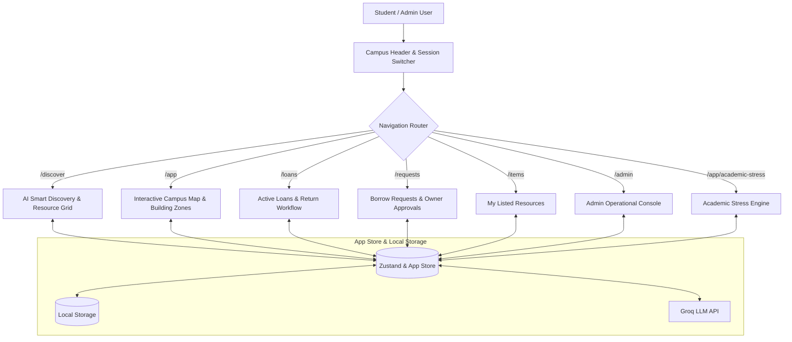

# 🔄 Campus Circular — Peer-to-Peer Campus Resource Exchange & Circular Economy Ecosystem

<p align="center">
  <a href="https://github.com/vihanshah/campuscircular">
    
  </a>
</p>

<p align="center">
  
  
  
  
  
  
  
  
</p>

---

## 📑 Table of Contents

- [Overview \& Vision](#-overview--vision)
- [Key Features \& Modules](#-key-features--modules)
  - [1. Interactive Campus Map \& Zone Positioning](#1-interactive-campus-map--zone-positioning)
  - [2. Peer-to-Peer Resource Exchange \& Borrowing Workflow](#2-peer-to-peer-resource-exchange--borrowing-workflow)
  - [3. AI Smart Discovery \& Natural Language Search Engine](#3-ai-smart-discovery--natural-language-search-engine)
  - [4. Role-Based Multi-User Authentication \& Account Switching](#4-role-based-multi-user-authentication--account-switching)
  - [5. Peer Direct Messaging \& Campus Community Channels](#5-peer-direct-messaging--campus-community-channels)
  - [6. Admin Operational Console \& Active Loans Tracking](#6-admin-operational-console--active-loans-tracking)
  - [7. Campus Circular Economy \& Sustainability Impact Engine](#7-campus-circular-economy--sustainability-impact-engine)
  - [8. Academic Stress Engine \& Student Wellness Suite](#8-academic-stress-engine--student-wellness-suite)
- [Technical Architecture \& Data Flow](#-technical-architecture--data-flow)
- [Demo Accounts \& Verified Credentials](#-demo-accounts--verified-credentials)
- [Component \& Module Catalog](#-component--module-catalog)
- [Technology Stack](#-technology-stack)
- [Project Directory Structure](#-project-directory-structure)
- [Getting Started \& Local Development](#-getting-started--local-development)
- [Production Build \& Deployment](#-production-build--deployment)
- [License](#-license)

---

## 📌 Overview & Vision

**Campus Circular** is an all-in-one peer-to-peer resource exchange platform and student wellness ecosystem designed specifically for university campuses.

College students frequently face high expenses for academic, technical, and creative gear—such as DSLR cameras, 4K cinema equipment, MacBooks, scientific calculators, lab kits, and specialized textbooks—which are often used for short-term projects and remain idle afterward.

**Campus Circular** solves this by establishing a campus-wide circular economy where students can safely **discover, request, borrow, lend, and exchange items** with verified peers. Combined with building-level campus map visualization, real-time peer messaging, an AI-powered smart discovery search engine, an operational admin control center, and an integrated academic stress management engine, Campus Circular transforms campus resource sharing into a seamless, sustainable experience.

---

## ✨ Key Features & Modules

### 1. Interactive Campus Map & Zone Positioning (`CampusMapView.tsx`)
* **Building Zone Coordinate Mapping**: Maps available campus resources directly onto precise campus zones to eliminate pin clumping and pinpoint physical retrieval locations:
  - 💻 **Tech Hub / CS Department**: Laptops, MacBooks, iPads, and high-performance computing accessories.
  - ⚡ **Engineering Block B**: Scientific calculators, electronics kits, microcontrollers, and engineering textbooks.
  - 📸 **Arts & Media Wing**: Sony 4K Cameras, Canon DSLRs, studio microphones, lighting rigs, and cinema projectors.
  - 🎾 **Sports Complex**: Tennis rackets, badminton sets, and recreational sports gear.
  - 🎵 **Central Quad Pathway**: Acoustic guitars, amplifiers, and open community sharing equipment.
* **Pin Disambiguation & Staggered Tooltips**: Automatic coordinate staggering prevents overlapping pins in dense building zones. Interactive map markers reveal distance, building location, item category badges, price rates, and direct buttons to open item details modals.

---

### 2. Peer-to-Peer Resource Exchange & Borrowing Workflow
* **Item Listing & Inventory Management (`MyItems.tsx`)**: Students can list their owned equipment with custom category tags, daily/hourly rates, pickup location preferences, condition ratings, and availability toggles.
* **Request & Owner Approval Pipeline (`MyRequests.tsx` & `MyLoans.tsx`)**:
  - Borrowers submit borrow requests with return dates and intended project use.
  - Equipment owners receive instant notifications to accept or decline pending peer requests.
  - Active loan status monitoring tracks pickup status, ongoing loans, and pending returns across students.

---

### 3. AI Smart Discovery & Natural Language Search Engine
* **Groq API LLM Integration**: Natural language processing powered by Groq LLM allows students to search using conversational queries (e.g., *"I need a camera for my media assignment due tonight"* or *"Looking for a calculator for Linear Algebra exams"*).
* **Semantic Query Parser**: Automatically maps natural language intent to categories, availability, building locations, and price ranges.
* **Category Pill Filtering & Search Bar**: Fast multi-tag filtering across Electronics, Cameras & Media, Lab Equipment, Textbooks, and Sports & Music.

---

### 4. Role-Based Multi-User Authentication & Account Switching
* **Verified Student & Admin Portals**: Dedicated authentication flows for verified campus students (`CC1001` through `CC1010`) and system administrators.
* **One-Click Demo Account Switcher (`CampusDeiHeader.tsx`)**: Easily switch active user sessions between different student accounts in real-time to test cross-user lending workflows, loan approvals, and peer messaging directly from the header dropdown menu.

---

### 5. Peer Direct Messaging & Campus Community Channels
* **WhatsApp-Style Peer Chat (`CampusChatModal.tsx`)**: Dynamic message bubble alignment, timestamping, read indicators, and direct chat launching from item listings.
* **Public Campus Discussion Channels (`GroupChatModal.tsx`)**: Public chat channels for general campus equipment requests, lost & found items, and project collaboration.

---

### 6. Admin Operational Console & Active Loans Tracking (`AdminDashboard.tsx`)
* **Live Active Loans Dashboard**: Overview of all ongoing peer loans across campus with loan duration metrics, borrower details, and lender information.
* **System Analytics & Audit Metrics**: Metrics on total peer exchanges, total monetary savings realized by students, platform activity logs, and user role management.

---

### 7. Campus Circular Economy & Sustainability Impact Engine (`CampusImpactWidget.tsx`)
* **Student Financial Savings Tracker**: Quantifies money saved by borrowing equipment instead of buying new.
* **E-Waste & Sustainability Metrics**: Tracks estimated e-waste reduction, plastic savings, and total circular exchanges completed across the student community.

---

### 8. Academic Stress Engine & Student Wellness Suite
* **Subject-Wise Academic Stress Engine (`AcademicStress.tsx`)**:
  - Calculates workload density using task difficulty multipliers (Easy $1.0\times$, Medium $1.35\times$, Hard $1.75\times$, Extreme $2.3\times$) and deadline urgency factors ($>24\text{h}$, $<3\text{d}$, $<7\text{d}$).
  - Categorizes workload into 5 stress tiers (Relaxed, Manageable, Busy, Overloaded, Critical) with subject strain breakdowns.
* **Integrated Wellness Tools**:
  - **Habit & Intentions Tracker (`HabitsTable.tsx`)**: 7-day weekly grid and 30-day calendar matrix for tracking daily academic and personal habits.
  - **Hydration & Sleep Monitor (`Wellness.tsx`)**: Track sleep quality ratings and daily water intake.
  - **Mindful Journal with Sentiment Analysis (`Journal.tsx`)**: Local auto-saving journal with sentiment tagging (*Positive*, *Reflective*, *Neutral*).
  - **Box Breathing Visualizer & Plasma Orb (`Meditation.tsx`)**: Guided 4-4-4 breathing exercises with an interactive WebGL plasma orb.
  - **Counselor Consultation Portal (`Consultation.tsx`)**: Book appointments with certified campus mental health advisors.

---

## 🏗️ Technical Architecture & Data Flow



---

## 🔑 Demo Accounts & Verified Credentials

Test cross-user request flows, owner approvals, and admin capabilities using any of the pre-configured verified student accounts:

| Account Role | Student ID / Email | Password | Student Name | Assigned Department & Focus |
| :--- | :--- | :--- | :--- | :--- |
| **Admin Console** | `admin@campus.edu` | `admin123` | Campus Administrator | System Operations & Audit |
| **Student CC1001** | `CC1001` | `pass1001` | Aarav Sharma | Computer Science & Tech Hub |
| **Student CC1002** | `CC1002` | `pass1002` | Ananya Verma | Media & Film Production |
| **Student CC1003** | `CC1003` | `pass1003` | Rohan Mehta | Electronics Engineering |
| **Student CC1004** | `CC1004` | `pass1004` | Priya Nair | Photography & Arts Wing |
| **Student CC1005** | `CC1005` | `pass1005` | Kabir Patel | Mechanical Engineering |
| **Student CC1006** | `CC1006` | `pass1006` | Diya Sengupta | Audio Systems & Music |
| **Student CC1007** | `CC1007` | `pass1007` | Alex Rivera | Design & Media Labs |
| **Student CC1008** | `CC1008` | `pass1008` | Vikram Joshi | Sports & Athletics |
| **Student CC1009** | `CC1009` | `pass1009` | Sanya Kapoor | Biotechnology & Science |
| **Student CC1010** | `CC1010` | `pass1010` | Tanmay Bhatia | General Academic Equipment |

---

## 🧩 Component & Module Catalog

| Component | Path | Description | Tech Stack |
|---|---|---|---|
| `CampusDeiHeader` | `client/src/components/CampusDeiHeader.tsx` | Header bar with user session dropdown, dark mode toggle, and quick nav | React, Lucide Icons, Wouter |
| `CampusDeiHero` | `client/src/components/CampusDeiHero.tsx` | Campus exchange hero section with active exchange partner cards | Framer Motion, React |
| `CampusResourceGrid` | `client/src/components/CampusResourceGrid.tsx` | Main resource marketplace grid with category filtering & details modal | React, TailwindCSS |
| `CampusMapView` | `client/src/components/discover/CampusMapView.tsx` | Interactive campus map displaying building zone pins and distance popups | React, Custom SVG |
| `CampusChatModal` | `client/src/components/chat/CampusChatModal.tsx` | Peer-to-peer real-time direct messaging interface | React, TailwindCSS |
| `CampusImpactWidget` | `client/src/components/CampusImpactWidget.tsx` | Financial savings and circular economy sustainability metrics card | React, Framer Motion |
| `GradientWaves` | `client/src/components/ui/GradientWaves.tsx` | Full-screen raymarching sine-plasma shader canvas | WebGL, `ogl`, React |
| `Orb` | `client/src/components/ui/Orb.tsx` | Interactive 3D plasma orb for meditation visualizer | WebGL, `ogl`, React |
| `Silk` | `client/src/components/ui/Silk.tsx` | Animated silk wave canvas background for score cards | WebGL, `@react-three/fiber` |
| `BorderGlow` | `client/src/components/ui/BorderGlow.tsx` | Animated gradient border container glow wrapper | CSS Animations, Tailwind |

---

## 💻 Technology Stack

* **Frontend Framework**: [React 19](https://react.dev/) & [TypeScript 5.6](https://www.typescriptlang.org/)
* **Build Tooling**: [Vite 7.1](https://vitejs.dev/) & [ESBuild](https://esbuild.github.io/)
* **Styling**: [TailwindCSS 4.1](https://tailwindcss.com/) & Vanilla CSS
* **Animations & Shaders**: [Framer Motion 12.2](https://www.framer.com/motion/), [GSAP 3.15](https://greensock.com/gsap/), [OGL WebGL](https://github.com/o-gl/ogl), and [Three.js / React Three Fiber](https://r3f.docs.pmnd.rs/)
* **State Management**: [Zustand 5.0](https://zustand-demo.pmnd.rs/) & React Context API
* **Client-Side Routing**: [Wouter 3.3](https://github.com/molefrog/wouter)
* **Backend Server**: [Express 4.21](https://expressjs.com/) on [Node.js](https://nodejs.org/)
* **AI & LLM Services**: [Groq API](https://groq.com/) for natural language semantic search
* **Package Manager**: [PNPM 10.4](https://pnpm.io/)

---

## 📁 Project Directory Structure

```
campuscircular/
├── client/                      # Frontend Application
│   ├── src/
│   │   ├── components/          # Reusable UI & Feature Components
│   │   │   ├── admin/           # Admin Console Modules
│   │   │   ├── chat/            # Peer Direct & Group Messaging
│   │   │   ├── discover/        # Interactive Map & Resource Discovery
│   │   │   ├── items/           # Resource Listing & Management
│   │   │   ├── loans/           # Active Loans & Return Tracking
│   │   │   ├── requests/        # Borrow Requests & Approvals
│   │   │   └── ui/              # Design System Primitives & Shaders
│   │   ├── contexts/            # React Context Providers (Theme, Auth)
│   │   ├── hooks/               # Custom React Hooks
│   │   ├── lib/                 # App Store, Mock Data, Utilities
│   │   ├── pages/               # Wouter Route Pages
│   │   ├── App.tsx              # Main Router & Provider Tree
│   │   ├── main.tsx             # DOM Entry Point
│   │   └── index.css            # Global CSS & Tailwind Design Tokens
│   └── index.html
├── server/                      # Express Backend Server & API Routes
│   ├── index.ts                 # Server Setup & Middleware
│   └── routes.ts                # Groq AI & Application Endpoints
├── shared/                      # Shared Types & Schemas
├── campus_circular_*.csv        # Seed Dataset Records (Students, Loans, Resources)
├── package.json                 # Project Dependencies & Scripts
├── tsconfig.json                # TypeScript Configuration
└── vite.config.ts               # Vite Configuration & Dev Server Rules
```

---

## 🚀 Getting Started & Local Development

### Prerequisites

- **Node.js**: `v18.0.0` or higher
- **PNPM**: `v9.0.0` or `v10.0.0`

### Installation

1. **Clone the repository**:
   ```bash
   git clone https://github.com/vihanshah/campuscircular.git
   cd campuscircular
   ```

2. **Install dependencies**:
   ```bash
   pnpm install
   ```

3. **Configure Environment Variables**:
   Create a `.env` file in the root directory (or update the existing `.env`):
   ```env
   PORT=5000
   GROQ_API_KEY=your_groq_api_key_here
   ```

4. **Start the Development Server**:
   ```bash
   pnpm run dev
   ```
   *The application will launch locally on `http://localhost:5173` (or the URL assigned by Vite).*

5. **Type Checking & Code Formatting**:
   ```bash
   # Run TypeScript type check
   pnpm run check

   # Format codebase with Prettier
   pnpm run format
   ```

---

## 📦 Production Build & Deployment

To create an optimized production build:

```bash
pnpm run build
```

To run the production bundle locally:

```bash
pnpm run start
```

---

## 📄 License

This project is licensed under the **MIT License**. See the [LICENSE](LICENSE) file for details.
